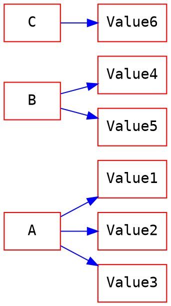
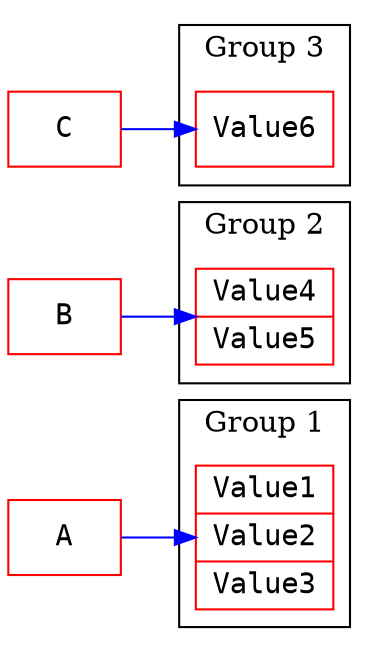

# GroupJoin
有時候當我們需要合併兩張表來彙整資料的時候 , 這兩張表可能是一對多的情況 , 此時若是使用 Join , 會得到多個 key 值相同但 value 不同的資料.
假設有一個人養了超過一隻的寵物 , 那麼我們在 Join 個人以及寵物的表格資料時 , 這個人就會出現多次. 如下
| 人名 | 寵物名 |
| ---- | ------ |
| 小明 | 烏龜名 |
| 小明 | 狗名   |
| 小明 | 貓名   |
這會增加我們彙整資料的困擾 . (必須再調用 GroupBy 方法 )
而 GroupJoin 就是在 Join 時就可以做彙整資料的動作.

### Join vs GroupJoin Excmple
#### 假設你有兩個表格
##### 表格一
| Key  | Value |
| ---- | ----- |
| Key1 | A     |
| Key2 | B     |
| Key3 | C     |

##### 表格二
| Key  | Value  |
| ---- | ------ |
| Key1 | Value1 |
| Key1 | Value2 |
| Key1 | Value3 |
| Key2 | Value4 |
| Key2 | Value5 |
| Key3 | Value6 |


使用 Join 以及 GroupJoin 的結果如下

#### 使用 Join 的結果
| Field1 | Field2 |
| ------ | ------ |
| A      | Value1 |
| A      | Value2 |
| A      | Value3 |
| B      | Value4 |
| B      | Value5 |
| C      | Value6 |


##### Join 示意圖

#### 使用 GroupJoin 的結果
| Field1 | Field2                     |
| ------ | -------------------------- |
| A      | {Value1 , Value2 , Value3} |
| B      | {Value4 , Value5}          |
| C      | {Value6}                   |
##### GroupJoin 示意圖


### [過載方法](https://docs.microsoft.com/zh-tw/dotnet/api/system.linq.enumerable.groupjoin?view=netframework-4.8)
GroupJoin 有兩個過載方法 (差別只在於是否傳入自定義 IEqualityComparer)
```C#
public static IEnumerable<TResult> GroupJoin<TOuter,TInner,TKey,TResult> (
        this IEnumerable<TOuter> outer,
        IEnumerable<TInner> inner,
        Func<TOuter,TKey> outerKeySelector, 
        Func<TInner,TKey> innerKeySelector, 
        Func<TOuter,IEnumerable<TInner>,TResult> resultSelector
);
```
```C#
public static IEnumerable<TResult> GroupJoin<TOuter,TInner,TKey,TResult> (
        this IEnumerable<TOuter> outer,
        IEnumerable<TInner> inner, 
        Func<TOuter,TKey> outerKeySelector,
        Func<TInner,TKey> innerKeySelector,    
        Func<TOuter,IEnumerable<TInner>,TResult> resultSelector, 
        IEqualityComparer<TKey> comparer
);
```
#### 說明
由過載方法可以發現 GroupJoin 與 Join 的差別只在於 resultSelector 不同. 也就是說 , Join 會展開集合 , 所以會有扁平的結果 , 也就是一個 TOuter 對應一個 TInner.  而 GroupJoin 則是一個 TOuter 對應一個 Enumerable<TInner> 集合(集合成員都有同樣的 Key )

### GroupJoin 的用法
```C#
class Person
{
     public string Name { get; set; }
}

class Pet
{
     public string Name { get; set; }
     public Person Owner { get; set; }
}

static void Main(string[] args)
{
     var people = new List<Person> {
             new Person { Name = "王大明" },
             new Person { Name = "蔡阿高" },
             new Person { Name = "黃飛龍" }
     };

     var pets = new List<Pet> {
             new Pet { Name = "小白", Owner = people[1] },
             new Pet { Name = "小黑", Owner = people[1] },
             new Pet { Name = "小藍", Owner = people[2] },
             new Pet { Name = "小綠", Owner = people[0] }
     };

     var query = people.GroupJoin(
                 pets,
                 person => person.Name,
                 pet => pet.Owner.Name,
                 (person, petCollection) => 
                     new { 
                             OwnerName = person.Name, 
                             Pet = petCollection.Select(p => p.Name) 
                         }
             ).ToList();
             
     foreach(var q in query)
     {
          Console.WriteLine($"OwnerName : {q.OwnerName}");
          foreach(var petName in q.Pet)
          {
               Console.WriteLine($" ----- petName : {petName}");
          }
     }
     Console.WriteLine("@@@@@@@@@@@@@@@@@@@@@@@@@@@@@@@@@@@@@@@");
     Console.WriteLine("@@@@@@@@@@@@@@@@@@@@@@@@@@@@@@@@@@@@@@@");

     var sqlLikeQuery = (from person in people
                         join pet in pets on person.Name equals pet.Owner.Name into ps
                         select new { 
                            OwnerName = person.Name, 
                            Pet = ps.Select(p => p.Name) 
                         }
                        ).ToList();
     foreach (var q in sqlLikeQuery)
     {
          Console.WriteLine($"OwnerName : {q.OwnerName}");
          foreach (var petName in q.Pet)
          {
               Console.WriteLine($" ----- petName : {petName}");
          }
     }

     Console.ReadKey();
}
```
##### 輸出結果
OwnerName : 王大明     
 ----- petName : 小綠          
OwnerName : 蔡阿高     
 ----- petName : 小白     
 ----- petName : 小黑     
OwnerName : 黃飛龍     
 ----- petName : 小藍     
@@@@@@@@@@@@@@@@@@@@@@@@@@@@@@@@@@@@@@@     
@@@@@@@@@@@@@@@@@@@@@@@@@@@@@@@@@@@@@@@     
OwnerName : 王大明     
 ----- petName : 小綠     
OwnerName : 蔡阿高     
 ----- petName : 小白     
 ----- petName : 小黑     
OwnerName : 黃飛龍     
 ----- petName : 小藍     
 
### 簡單實作自己的 GroupJoin
```C#
public static IEnumerable<TResult> MyGroupJoin<TOuter, TInner, TKey, TResult>(this IEnumerable<TOuter> outer, IEnumerable<TInner> inner, Func<TOuter, TKey> outerKeySelector, Func<TInner, TKey> innerKeySelector, Func<TOuter, IEnumerable<TInner>, TResult> resultSelector, IEqualityComparer<TKey> comparer = null)
{
     if (outer is null || inner is null || outerKeySelector is null || innerKeySelector is null || resultSelector is null)
     {
          throw new Exception("null");
     }
     return MyGroupJoinIterator(outer, inner, outerKeySelector, innerKeySelector, resultSelector, comparer);
}

static IEnumerable<TResult> MyGroupJoinIterator<TOuter, TInner, TKey, TResult>(IEnumerable<TOuter> outer, IEnumerable<TInner> inner, Func<TOuter, TKey> outerKeySelector, Func<TInner, TKey> innerKeySelector, Func<TOuter, IEnumerable<TInner>, TResult> resultSelector, IEqualityComparer<TKey> comparer)
{
     Lookup<TKey, TInner> lookup = Lookup<TKey, TInner>.CreateForJoin(inner, innerKeySelector, comparer);
     foreach (var item in outer)
     {
          var group = lookup.GetGrouping(outerKeySelector(item), false);
          yield return resultSelector(item, group ?? new TInner[0] as IEnumerable<TInner>);
          //or use
          //yield return resultSelector(item, lookup[outerKeySelector(item)]);
     }
}
```


### Reference
[GroupJoin.cs](https://github.com/dotnet/corefx/blob/master/src/System.Linq/src/System/Linq/GroupJoin.cs)
[GroupJoin (left outer join)](https://linqsamples.com/linq-to-objects/join/GroupJoin)    
[Linq to Entities join vs groupjoin](https://stackoverflow.com/questions/15595289/linq-to-entities-join-vs-groupjoin)    
[C#的利器LINQ-GroupJoin的應用](https://ithelp.ithome.com.tw/articles/10196715)
[LINQ自學筆記-語法應用-聚合資料-Join-3、GroupJoin](https://ithelp.ithome.com.tw/articles/10106321)
### Thank you! 

You can find me on

- [GitHub](https://github.com/s0920832252)
- [Facebook](https://www.facebook.com/fourtune.chen)

若有謬誤 , 煩請告知 , 新手發帖請多包涵

# :100: :muscle: :tada: :sheep: 
