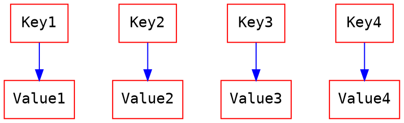
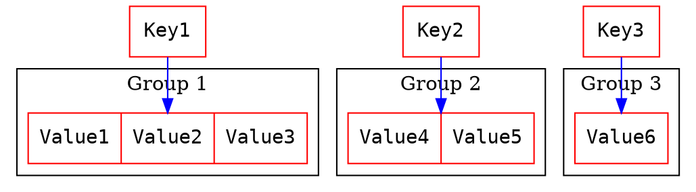

# LinQ基礎 - Lookup

### [Lookup](https://docs.microsoft.com/en-us/dotnet/api/system.linq.lookup-2?redirectedfrom=MSDN&view=netframework-4.8)
Lookup 是一個 key 可以對應到一個或是多個 value 的集合類型. Lookup 無法使用關鍵字 new 創造 , 只能透過 LinQ 的方法 ToLookup() 來產生. 其與 Dictionary 的差異如下圖.

#### 圖示
##### Dictionary : 一個 key 只能對應一個 value


##### Lookup : 一個 key 對應一個 group , 也就是可以對應至少一個 value


#### 使用時機
通常是我們需要可以透過 key 去管理群體(複數)的時候使用. 因此在 LinQ 裡面 , Join 或是 GroupBy 皆會使用到 Lookup.

#### Lookup 的用法
```C#
static void Main(string[] args)
{
    List<(string groupName, string personName)> groups = new List<(string groupName, string personName)>
    {
        ("天空鳥隊","王大明"),
        ("小蠻牛隊","紐魔王"),
        ("臭雞蛋隊","樂高高"),
        ("臭雞蛋隊","蠟筆新"),
        ("大香蕉隊","小丸子"),
    };

    // 使用 name 作為群組的 key , 日後將透過這個 key 去調出群組
    ILookup<string, (string, string)> lookup = groups.ToLookup(student => student.groupName);
    // 叫出 臭雞蛋 群組的成員
    Console.WriteLine($"叫出 臭雞蛋隊的成員");
    foreach ((string name, string personName) in lookup["臭雞蛋隊"])
    {
        Console.WriteLine($"{name} {personName}");
    }

    Console.WriteLine($"\n走訪所有的 lookup 成員");
    foreach (IGrouping<string, (string, string)> group in lookup)
    {
        Console.WriteLine($"{group.Key} :");
        Console.WriteLine($"---- ");
        foreach ((string name, string personName) in group)
        {
            Console.WriteLine($"{name} {personName}");
        }
        Console.WriteLine($"---- ");
        Console.WriteLine($"");
    }

    Console.ReadKey();
}
```
##### 輸出結果


---

#### Lookup 的 Code 
```C#
public static ILookup<TKey, TSource> ToLookup<TSource, TKey>(this IEnumerable<TSource> source, Func<TSource, TKey> keySelector, IEqualityComparer<TKey> comparer = null)
{
    if (source is null || keySelector is null)
    {
        throw new Exception("null");
    }
    return Lookup<TKey, TSource>.Create(source, keySelector, comparer);
}

public static ILookup<TKey, TElement> ToLookup<TSource, TKey, TElement>(this IEnumerable<TSource> source, Func<TSource, TKey> keySelector, Func<TSource, TElement> elementSelector, IEqualityComparer<TKey> comparer = null)
{
    if (source is null || keySelector is null || elementSelector is null)
    {
        throw new Exception("null");
    }
    return Lookup<TKey, TElement>.Create(source, keySelector, elementSelector, comparer);
}

public interface ILookup<TKey, TElement> : IEnumerable<IGrouping<TKey, TElement>>
{
    int Count { get; }
    IEnumerable<TElement> this[TKey key] { get; }
    bool Contains(TKey key);
}

public class Lookup<TKey, TElement> : IEnumerable<IGrouping<TKey, TElement>>, ILookup<TKey, TElement>
{
    readonly IEqualityComparer<TKey> comparer;
    Grouping[] groupings;
    Grouping lastGrouping;

    internal static Lookup<TKey, TElement> Create<TSource>(IEnumerable<TSource> source, Func<TSource, TKey> keySelector, Func<TSource, TElement> elementSelector, IEqualityComparer<TKey> comparer)
    {
        Debug.Assert(source != null);
        Debug.Assert(keySelector != null);
        Debug.Assert(elementSelector != null);

        Lookup<TKey, TElement> lookup = new Lookup<TKey, TElement>(comparer);
        foreach (TSource item in source)
        {
            lookup.GetGrouping(keySelector(item), true).Add(elementSelector(item));
        }

        return lookup;
    }

    internal static Lookup<TKey, TElement> Create(IEnumerable<TElement> source, Func<TElement, TKey> keySelector, IEqualityComparer<TKey> comparer)
    {
        Debug.Assert(source != null);
        Debug.Assert(keySelector != null);

        Lookup<TKey, TElement> lookup = new Lookup<TKey, TElement>(comparer);
        foreach (TElement item in source)
        {
            lookup.GetGrouping(keySelector(item), true).Add(item);
        }

        return lookup;
    }

    internal static Lookup<TKey, TElement> CreateForJoin(IEnumerable<TElement> source, Func<TElement, TKey> keySelector, IEqualityComparer<TKey> comparer)
    {
        Lookup<TKey, TElement> lookup = new Lookup<TKey, TElement>(comparer);
        foreach (TElement item in source)
        {
            TKey key = keySelector(item);
            if (key != null) {
                lookup.GetGrouping(key, true).Add(item);
            }
        }
        return lookup;
    }

    Lookup(IEqualityComparer<TKey> comparer)
    {
        if (comparer == null) comparer = EqualityComparer<TKey>.Default;
        this.comparer = comparer;
        groupings = new Grouping[7];
    }

    public int Count { get; private set; }

    public IEnumerable<TElement> this[TKey key]
    {
        get
        {
            Grouping grouping = GetGrouping(key, false);
            return grouping ?? Array.Empty<TElement>() as IEnumerable<TElement>;
            // Array.Empty<TElement>() 是 Array 的靜態 field 
            // 其值為 new TElement[0] 
        }
    }

    public bool Contains(TKey key)
    {
        return GetGrouping(key, false) != null;
    }

    public IEnumerator<IGrouping<TKey, TElement>> GetEnumerator()
    {
        Grouping g = lastGrouping;
        if (g != null)
        {
            do
            {
                g = g.next;
                yield return g;

                Console.WriteLine("groupi喔  : " + g.Key);
            } while (g != lastGrouping);
        }
    }

    public IEnumerable<TResult> ApplyResultSelector<TResult>(Func<TKey, IEnumerable<TElement>, TResult> resultSelector)
    {
        Grouping g = lastGrouping;
        if (g != null)
        {
            do
            {
                g = g.next;
                if (g.count != g.elements.Length) 
                { 
                     Array.Resize<TElement>(ref g.elements, g.count); 
                }
                yield return resultSelector(g.key, g.elements);
            } while (g != lastGrouping);
        }
    }

    IEnumerator IEnumerable.GetEnumerator() => GetEnumerator();
    
    internal int InternalGetHashCode(TKey key)
    {
        //Microsoft DevDivBugs 171937. work around comparer implementations that throw when passed null
        return (key == null) ? 0 : comparer.GetHashCode(key) & 0x7FFFFFFF;
    }

    internal Grouping GetGrouping(TKey key, bool create)
    {
        int hashCode = InternalGetHashCode(key);
        for (Grouping g = groupings[hashCode % groupings.Length]; g != null; g = g.hashNext)
            if (g.hashCode == hashCode && comparer.Equals(g.key, key)) return g;
        if (create)
        {
            if (Count == groupings.Length) Resize();
            int index = hashCode % groupings.Length;
            Grouping g = new Grouping
            {
                key = key,
                hashCode = hashCode,
                elements = new TElement[1],
                hashNext = groupings[index]
            };
            groupings[index] = g;
            if (lastGrouping == null)
            {
                g.next = g;
            }
            else
            {
                g.next = lastGrouping.next;
                lastGrouping.next = g;
            }
            lastGrouping = g;
            Count++;
            return g;
        }
        return null;
    }

    void Resize()
    {
        int newSize = checked(Count * 2 + 1);
        Grouping[] newGroupings = new Grouping[newSize];
        Grouping g = lastGrouping;
        do
        {
            g = g.next;
            int index = g.hashCode % newSize;
            g.hashNext = newGroupings[index];
            newGroupings[index] = g;
        } while (g != lastGrouping);
        groupings = newGroupings;
    }

    internal class Grouping : IGrouping<TKey, TElement>, IList<TElement>
    {
        internal TKey key;
        internal int hashCode;
        internal TElement[] elements;
        internal int count;
        internal Grouping hashNext;
        internal Grouping next;

        internal void Add(TElement element)
        {
            if (elements.Length == count) Array.Resize(ref elements, checked(count * 2));
            elements[count] = element;
            count++;
        }

        public IEnumerator<TElement> GetEnumerator()
        {
            for (int i = 0; i < count; i++)
            {
                yield return elements[i];
            }
        }

        public TKey Key => key;

        IEnumerator IEnumerable.GetEnumerator() => GetEnumerator();

        int ICollection<TElement>.Count => count;
        bool ICollection<TElement>.IsReadOnly => true;
        bool ICollection<TElement>.Contains(TElement item) => elements.Contains(item);
        void ICollection<TElement>.CopyTo(TElement[] array, int arrayIndex) => Array.Copy(elements, 0, array, arrayIndex, count);
        int IList<TElement>.IndexOf(TElement item) => Array.IndexOf(elements, item, 0, count);
        void IList<TElement>.Insert(int index, TElement item) => throw new NotImplementedException();
        void IList<TElement>.RemoveAt(int index) => throw new NotImplementedException();
        void ICollection<TElement>.Add(TElement item) => throw new NotImplementedException();
        void ICollection<TElement>.Clear() => throw new NotImplementedException();
        bool ICollection<TElement>.Remove(TElement item) => throw new NotImplementedException();

        TElement IList<TElement>.this[int index]
        {
            get
            {
                if (index < 0 || index >= count) throw new Exception("out of range");
                return elements[index];
            }
            set => throw new NotImplementedException();
        }
    }
}
```

### Summary
- Lookup 的建立流程    
    - 使用 Create() 去建立 Lookup 物件 (建立分組資料集合)
    - 走訪資料集合並且使用 GetGrouping() 去得到 group
        - 若該資料的 key 與所有 group 的 key 都不同 , 則為其建立一個 group 回傳
        - 若該資料的 key 與某個 group 的 key 相同 , 則將該 group 回傳
    - 使用 Add() 去將元素放入上述使用 GetGrouping() 得到的 group 中

- Lookup 的 grouping[] size 預設為 7 , 但在每次 GetGrouping() 時候 , 都會去檢查目前空間是否已經使用完畢. 若使用完畢則使用 Lookup 的 Resize() 這個方法去增加 grouping[] size --- "目前的全部空間" * 2 +1

#### 參考來源
[Lookup.cs](https://github.com/dotnet/corefx/blob/master/src/System.Linq/src/System/Linq/Lookup.cs)    
[Grouping.cs](https://github.com/dotnet/corefx/blob/master/src/System.Linq/src/System/Linq/Grouping.cs)    
[Enumerable.cs](https://github.com/microsoft/referencesource/blob/master/System.Core/System/Linq/Enumerable.cs)    
[Lookup In LINQ](https://www.c-sharpcorner.com/UploadFile/33b051/lookup-in-linq/)    
[C#高级编程五十四天----Lookup类和有序字典](https://blog.csdn.net/shanyongxu/article/details/47071607)    


### Thank you! 

You can find me on

- [GitHub](https://github.com/s0920832252)
- [Facebook](https://www.facebook.com/fourtune.chen)

若有謬誤 , 煩請告知 , 新手發帖請多包涵

# :100: :muscle: :tada: :sheep: 
