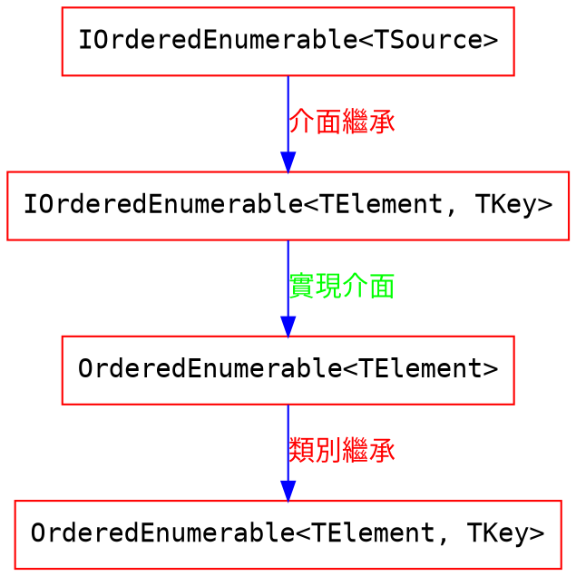

# OrderBy & ThenBy & OrderByDescending & ThenByDescending 實作探討

### 前言
OrderBy & OrderByDescending 是設定第一個排序方式為遞增或是遞減 , ThenBy & ThenByDescending 則是設定之後的排序方式.

**LINQ 的排序方法都回傳 IOrderedEnumerable 型別** , 此是 LinQ 方法可以支援複數排序方式的關鍵.

### [Source Code 探討](referencesource/System.Core/System/Linq/Enumerable.cs)

#### 比較 OrderBy 系列
##### OrderBy & OrderByDescending
```C#
public static IOrderedEnumerable<TSource> MyOrderBy<TSource, TKey>(this IEnumerable<TSource> source, Func<TSource, TKey> keySelector)
{
    return new OrderedEnumerable<TSource, TKey>(source, keySelector, null, false);
}

public static IOrderedEnumerable<TSource> MyOrderBy<TSource, TKey>(this IEnumerable<TSource> source, Func<TSource, TKey> keySelector, IComparer<TKey> comparer)
{
    return new OrderedEnumerable<TSource, TKey>(source, keySelector, comparer, false);
}

public static IOrderedEnumerable<TSource> MyOrderByDescending<TSource, TKey>(this IEnumerable<TSource> source, Func<TSource, TKey> keySelector)
{
    return new OrderedEnumerable<TSource, TKey>(source, keySelector, null, true);
}

public static IOrderedEnumerable<TSource> MyOrderByDescending<TSource, TKey>(this IEnumerable<TSource> source, Func<TSource, TKey> keySelector, IComparer<TKey> comparer)
{
    return new OrderedEnumerable<TSource, TKey>(source, keySelector, comparer, true);
}
```
由上可以看出 OrderBy 以及 OrderByDescending 皆會 new 一個 實作 IOrderedEnumerable<TSource> 的 OrderedEnumerable<TSource, TKey> 物件回傳. 其之間的差別只是傳入的參數不同. 
1. 是否有自定義比較器
2. 是遞增還是遞減排序

另外因為 OrderedEnumerable<TSource, TKey> 實作 IOrderedEnumerable<TSource> , 所以可以拿 OrderedEnumerable<TSource, TKey> 物件作為回傳結果.

繼承關西大概如下 

#### 比較 ThenBy 系列
##### ThenBy & ThenByDescending
```C#
public static IOrderedEnumerable<TSource> MyThenBy<TSource, TKey>(this IOrderedEnumerable<TSource> source, Func<TSource, TKey> keySelector)
{
    if (source is null)
    {
        throw new Exception("source is null");
    }
    return source.CreateOrderedEnumerable<TKey>(keySelector, null, false);
}

public static IOrderedEnumerable<TSource> MyThenBy<TSource, TKey>(this IOrderedEnumerable<TSource> source, Func<TSource, TKey> keySelector, IComparer<TKey> comparer)
{
    if (source is null)
    {
        throw new Exception("source is null");
    }
    return source.CreateOrderedEnumerable<TKey>(keySelector, comparer, false);
}

public static IOrderedEnumerable<TSource> MyThenByDescending<TSource, TKey>(this IOrderedEnumerable<TSource> source, Func<TSource, TKey> keySelector)
{
    if (source is null)
    {
        throw new Exception("source is null");
    }
    return source.CreateOrderedEnumerable<TKey>(keySelector, null, true);
}

public static IOrderedEnumerable<TSource> MyThenByDescending<TSource, TKey>(this IOrderedEnumerable<TSource> source, Func<TSource, TKey> keySelector, IComparer<TKey> comparer)
{
    if (source is null)
    {
        throw new Exception("source is null");
    }
    return source.CreateOrderedEnumerable<TKey>(keySelector, comparer, true);
}
```

由以上可以知道 ThenBy & ThenByDescending 都會去執行 CreateOrderedEnumerable , 並回傳其結果.  其之間的差別只是傳入的參數不同.
1. 是否有自定義比較器
2. 是遞增還是遞減排序

因為 ThenBy / ThenByDescending 的輸入參數型態是 IOrderedEnumerable<TSource> , 所以 ThenBy 一定要接在 OrderBy 後面使用 . 

ThenBy / ThenByDescending 會執行 CreateOrderedEnumerable 方法來更新 OrderedEnumerable.--- 接續使用已經建立好的 OrderedEnumerable<TSource, TKey> 類別 (不論是 OrderBy 家族哪一個建立的)

#### ThenBy 與 OrderBy 的差異之處
##### CreateOrderedEnumerable 方法
```C#
IOrderedEnumerable<TElement> IOrderedEnumerable<TElement>.CreateOrderedEnumerable<TKey>(Func<TElement, TKey> keySelector, IComparer<TKey> comparer, bool descending)
{
    return new OrderedEnumerable<TElement, TKey>(Source, keySelector, comparer, descending)
    {
        Parent = this
    };
}
```

CreateOrderedEnumerable 會再 new 一個新的 OrderedEnumerable<TElement, TKey> 物件 , 且會記錄 Parent 是誰(之前的 OrderedEnumerable - 比較條件) , 有點 LinkList 的感覺.

所以 ThenBy 再作的事情就是 , new 一個新的 OrderedEnumerable 並且將來源 OrderedEnumerable 指派給新的 OrderedEnumerable 的 Parent 屬性.

##### OrderedEnumerable<TElement, TKey> 的建構子原始碼
```C#
internal OrderedEnumerable(IEnumerable<TElement> source, Func<TElement, TKey> keySelector, IComparer<TKey> comparer, bool descending)
{
    if (source is null || keySelector is null)
    {
        throw new Exception("null exception");
    }
    this.Source = source;
    this.Parent = null;
    this.KeySelector = keySelector;
    this.Comparer = comparer ?? Comparer<TKey>.Default;
    this.Descending = descending;
}
```
1. 檢查 source 跟 keySelector 是否為 null , 若為 null 會回傳 Exception.
2. 若無設定 comparer 使用預設的比較器
3. 參數 descending 決定是否遞減
4. parent 紀錄是誰 new 了這個新的 OrderedEnumerable
2. 不論是 OrderBy 還是 ThenBy 都有 Source 去指向集合. 所以不管 new 了幾個 OrderedEnumerable 物件, 它們都是**指向同一個集合**.

在這邊我們發現了 OrderBy 及 ThenBy 的差別就是只有 ThenBy 會指定 this 給 parent , 所以**只有 ThenBy 接續增加排序條件才會有用的原因. 因為 ThenBy 會去紀錄之前的排序條件為何.**

#### 排序集合的走訪
##### GetEnumerator
```C#
public IEnumerator<TElement> GetEnumerator()
{
    var buffer = new Buffer<TElement>(Source);
    if (buffer.Count > 0)
    {
        EnumerableSorter<TElement> sorter = GetEnumerableSorter(null);
        int[] map = sorter.Sort(buffer.Items, buffer.Count);
        for (var i = 0; i < buffer.Count; i++)
        {
            yield return buffer.Items[map[i]];
        }
    }
}
```
- 將 Source 轉為 Buffer
    - Buffer 是一個 struct , 先不要理它 , 想成是類似陣列的東西就好XD.
- 執行 GetEnumerableSorter 建立 EnumerableSorter
    - 使用 Sort 排序 , 回傳**排序後的索引表**.
    1. 建立一個陣列(索引表) , 有每一個元素再原本位置的索引.
    2. 依據元素的大小 , 排序索引.
    3. 所以若是一個集合有八個元素 , 最後那個元素是最小的 , 在排序後 , 索引表的第一個位置將會是 7 (表示第八個元素的位置).  第二個位置將會是第二小的元素的索引位置. 以此類推.
- 用 yield 循序回傳元素

#### 排序的細節
##### EnumerableSorter
```C#
internal override EnumerableSorter<TElement> GetEnumerableSorter(EnumerableSorter<TElement> next)
{
    EnumerableSorter<TElement> sorter = new EnumerableSorter<TElement, TKey>(KeySelector, Comparer, Descending, next);
    if (Parent != null)
    {
        sorter = Parent.GetEnumerableSorter(sorter);
    }
    return sorter;
}
```
GetEnumerableSorter 會建立一個 EnumerableSorter 實體 , 若有使用 ThenBy , 就會有 Parent 鍊. 程式會將目前產生的 EnumerableSorter 實體 , 作為 Parent EnumerableSorter 實體的 next. 不斷用 Parent.GetEnumerableSorter(sorter) 取得 Parent的 Sorter.

上述文字的意思用感覺的講法的就是 ,
我們要走訪 OrderedEnumerable 的 LinkList (一直探訪 Parent). 但是在每一次走訪之前會先 new 一個 EnumerableSorter. 然後再走訪到下一個點. 當抵達下一個點的時候會再 new 一個 EnumerableSorter. 並且會將其 next 屬性指向走訪之前產生的 EnumerableSorter. 
也就是說 , 是在走訪的 LinkList 的同時 , 也在建立 LinkList 的感覺.

再換句話說 GetEnumerableSorter 是在依據實體化每個排序條件的Sorter , 並且將第一個(始祖)查詢條件回傳.

##### Sort
```C#
internal int[] Sort(TElement[] elements, int count)
{
    ComputeKeys(elements, count);
    var map = new int[count];
    for (var i = 0; i < count; i++) map[i] = i;
    QuickSort(map, 0, count - 1);
    return map;
}
```
- 透過 ComputeKeys . 轉換集合內元素成指定的 Key. 方便日後比較排序.
- 初始化 map , 具有元素的索引值
- QuickSort 排序

##### ComputeKeys
```
internal override void ComputeKeys(TElement[] elements, int count)
{
    Keys = new TKey[count];
    for (var i = 0; i < count; i++)
    {
        Keys[i] = KeySelector(elements[i]);
    }
    Next?.ComputeKeys(elements, count);
}
```
- 轉換集合內元素成指定的 Key. 方便日後比較排序
- 若有 Next 屬性 , 則到 Next 指派的 EnumerableSorter 物件 , 並切依照該 EnumerableSorter 物件的設定去轉換集合內元素.
  - 上面建立的 EnumerableSorter 的 Link List 就是用在這.
- **還沒有排序**

##### QuickSort
```C#
internal void QuickSort(IList<int> map, int left, int right)
{
    do
    {
        var i = left;
        var j = right;
        var x = map[i + ((j - i) >> 1)];
        do
        {
            while (i < map.Count && CompareKeys(x, map[i]) > 0) i++;
            while (j >= 0 && CompareKeys(x, map[j]) < 0) j--;
            if (i > j) break;
            if (i < j)
            {
                var temp = map[i];
                map[i] = map[j];
                map[j] = temp;
            }
            i++;
            j--;
        } while (i <= j);
        if (j - left <= right - i)
        {
            if (left < j) QuickSort(map, left, j);
            left = i;
        }
        else
        {
            if (i < right) QuickSort(map, i, right);
            right = j;
        }
    } while (left < right);
}
```
- 先不要管 QuickSort 的原始碼再幹嘛 , 反正你知道它再排序索引就好.
- 值得注意的是 CompareKeys 方法.

##### CompareKeys
```C#
internal override int CompareKeys(int index1, int index2)
{
    var compareResult = Comparer.Compare(Keys[index1], Keys[index2]);

    switch (compareResult)
    {
        case 0 when Next == null: // 因為這個條件相等且沒有下一個比較條件 , 回傳比較結果
            return index1 - index2; // 因為 Quick Sort 的原因.
        case 0: // 因為這個條件相等 , 所以繼續比較下一個條件
            return Next.CompareKeys(index1, index2);
        default: // 條件不等 , 所以依照是否設定遞增回傳比較結果
            return Descending ? -compareResult : compareResult;
    }
}
```
- 排序是需要比較兩物件的大小. 而 CompareKeys 就是專門用來比較大小的方法 !!!
- GetEnumerableSorter 會回傳祖先 EnumerableSorter. 所以比較兩物件大小的順序是
    1. 先透過祖先 EnumerableSorter 的 CompareKeys 內的 Comparer.Compare 計算比較結果 
    2. 若結果相同 , 且又有下一個比較條件 , 則開始比較下一個條件. 此會一直比較到有某個條件結果不同或是沒有下一個比較條件.
    3. 回傳結果相同或是結果不同 , 結果不同的情況會需要再參考 Descending , 以回傳大於還是小於.

### 完整原始碼
```C#
// 以下是稍微將原始碼簡化後的結果. 不然我大概一個月後就看不懂了 Orz
public static class MyEnumerable
{
    public static IOrderedEnumerable<TSource> MyOrderBy<TSource, TKey>(this IEnumerable<TSource> source, Func<TSource, TKey> keySelector)
    {
        return new OrderedEnumerable<TSource, TKey>(source, keySelector, null, false);
    }

    public static IOrderedEnumerable<TSource> MyOrderBy<TSource, TKey>(this IEnumerable<TSource> source, Func<TSource, TKey> keySelector, IComparer<TKey> comparer)
    {
        return new OrderedEnumerable<TSource, TKey>(source, keySelector, comparer, false);
    }

    public static IOrderedEnumerable<TSource> MyOrderByDescending<TSource, TKey>(this IEnumerable<TSource> source, Func<TSource, TKey> keySelector)
    {
        return new OrderedEnumerable<TSource, TKey>(source, keySelector, null, true);
    }

    public static IOrderedEnumerable<TSource> MyOrderByDescending<TSource, TKey>(this IEnumerable<TSource> source, Func<TSource, TKey> keySelector, IComparer<TKey> comparer)
    {
        return new OrderedEnumerable<TSource, TKey>(source, keySelector, comparer, true);
    }

    public static IOrderedEnumerable<TSource> MyThenBy<TSource, TKey>(this IOrderedEnumerable<TSource> source, Func<TSource, TKey> keySelector)
    {
        if (source is null)
        {
            throw new Exception("source is null");
        }
        return source.CreateOrderedEnumerable<TKey>(keySelector, null, false);
    }

    public static IOrderedEnumerable<TSource> MyThenBy<TSource, TKey>(this IOrderedEnumerable<TSource> source, Func<TSource, TKey> keySelector, IComparer<TKey> comparer)
    {
        if (source is null)
        {
            throw new Exception("source is null");
        }
        return source.CreateOrderedEnumerable<TKey>(keySelector, comparer, false);
    }

    public static IOrderedEnumerable<TSource> MyThenByDescending<TSource, TKey>(this IOrderedEnumerable<TSource> source, Func<TSource, TKey> keySelector)
    {
        if (source is null)
        {
            throw new Exception("source is null");
        }
        return source.CreateOrderedEnumerable<TKey>(keySelector, null, true);
    }

    public static IOrderedEnumerable<TSource> MyThenByDescending<TSource, TKey>(this IOrderedEnumerable<TSource> source, Func<TSource, TKey> keySelector, IComparer<TKey> comparer)
    {
        if (source is null)
        {
            throw new Exception("source is null");
        }

        return source.CreateOrderedEnumerable<TKey>(keySelector, comparer, true);
    }

    internal abstract class OrderedEnumerable<TElement> : IOrderedEnumerable<TElement>
    {
        internal IEnumerable<TElement> Source { get; set; }

        public IEnumerator<TElement> GetEnumerator()
        {
            var buffer = new Buffer<TElement>(Source);
            if (buffer.Count > 0)
            {
                EnumerableSorter<TElement> sorter = GetEnumerableSorter(null);
                int[] map = sorter.Sort(buffer.Items, buffer.Count);
                for (var i = 0; i < buffer.Count; i++)
                {
                    yield return buffer.Items[map[i]];
                }
            }
        }

        internal abstract EnumerableSorter<TElement> GetEnumerableSorter(EnumerableSorter<TElement> next);

        IEnumerator IEnumerable.GetEnumerator()
        {
            return GetEnumerator();
        }

        IOrderedEnumerable<TElement> IOrderedEnumerable<TElement>.CreateOrderedEnumerable<TKey>(Func<TElement, TKey> keySelector, IComparer<TKey> comparer, bool descending)
        {
            return new OrderedEnumerable<TElement, TKey>(Source, keySelector, comparer, descending)
            {
                Parent = this
            };
        }
    }

    internal class OrderedEnumerable<TElement, TKey> : OrderedEnumerable<TElement>
    {
        internal OrderedEnumerable<TElement> Parent { get; set; }
        internal Func<TElement, TKey> KeySelector { get; }
        internal IComparer<TKey> Comparer { get; }
        internal bool Descending { get; }

        internal OrderedEnumerable(IEnumerable<TElement> source, Func<TElement, TKey> keySelector, IComparer<TKey> comparer, bool descending)
        {
            if (source is null || keySelector is null)
            {
                throw new Exception("null exception");
            }
            this.Source = source;
            this.Parent = null;
            this.KeySelector = keySelector;
            this.Comparer = comparer ?? Comparer<TKey>.Default;
            this.Descending = descending;
        }

        internal override EnumerableSorter<TElement> GetEnumerableSorter(EnumerableSorter<TElement> next)
        {
            EnumerableSorter<TElement> sorter = new EnumerableSorter<TElement, TKey>(KeySelector, Comparer, Descending, next);
            if (Parent != null)
            {
                sorter = Parent.GetEnumerableSorter(sorter);
            }
            return sorter;
        }
    }

    internal abstract class EnumerableSorter<TElement>
    {
        internal abstract void ComputeKeys(TElement[] elements, int count);

        internal abstract int CompareKeys(int index1, int index2);

        internal int[] Sort(TElement[] elements, int count)
        {
            ComputeKeys(elements, count);
            var map = new int[count];
            for (var i = 0; i < count; i++) map[i] = i;
            QuickSort(map, 0, count - 1);
            return map;
        }

        internal void QuickSort(IList<int> map, int left, int right)
        {
            do
            {
                var i = left;
                var j = right;
                var x = map[i + ((j - i) >> 1)];
                do
                {
                    while (i < map.Count && CompareKeys(x, map[i]) > 0) i++;
                    while (j >= 0 && CompareKeys(x, map[j]) < 0) j--;
                    if (i > j) break;
                    if (i < j)
                    {
                        var temp = map[i];
                        map[i] = map[j];
                        map[j] = temp;
                    }
                    i++;
                    j--;
                } while (i <= j);
                if (j - left <= right - i)
                {
                    if (left < j) QuickSort(map, left, j);
                    left = i;
                }
                else
                {
                    if (i < right) QuickSort(map, i, right);
                    right = j;
                }
            } while (left < right);
        }
    }

    internal class EnumerableSorter<TElement, TKey> : EnumerableSorter<TElement>
    {
        internal Func<TElement, TKey> KeySelector { get; }
        internal IComparer<TKey> Comparer { get; }
        internal bool Descending { get; }
        internal EnumerableSorter<TElement> Next { get; }
        internal TKey[] Keys { get; set; }

        internal EnumerableSorter(Func<TElement, TKey> keySelector, IComparer<TKey> comparer, bool descending, EnumerableSorter<TElement> next)
        {
            this.KeySelector = keySelector;
            this.Comparer = comparer;
            this.Descending = descending;
            this.Next = next;
        }

        internal override void ComputeKeys(TElement[] elements, int count)
        {
            Keys = new TKey[count];
            for (var i = 0; i < count; i++)
            {
                Keys[i] = KeySelector(elements[i]);
            }
            Next?.ComputeKeys(elements, count);
        }

        internal override int CompareKeys(int index1, int index2)
        {
            var compareResult = Comparer.Compare(Keys[index1], Keys[index2]);

            switch (compareResult)
            {
                case 0 when Next == null: // 因為這個條件相等且沒有下一個比較條件 , 回傳比較結果
                    return index1 - index2; // 因為 Quick Sort 的原因.
                case 0: // 因為這個條件相等 , 所以繼續比較下一個條件
                    return Next.CompareKeys(index1, index2);
                default: // 條件不等 , 所以依照是否設定遞增回傳比較結果
                    return Descending ? -compareResult : compareResult;
            }
        }
    }

    internal struct Buffer<TElement>
    {
        internal TElement[] Items { get; }
        internal int Count { get; }

        internal Buffer(IEnumerable<TElement> source)
        {
            TElement[] items = null;
            var count = 0;
            if (source is ICollection<TElement> collection)
            {
                count = collection.Count;
                if (count > 0)
                {
                    items = new TElement[count];
                    collection.CopyTo(items, 0);
                }
            }
            else
            {
                foreach (var item in source)
                {
                    if (items == null)
                    {
                        items = new TElement[4];
                    }
                    else if (items.Length == count)
                    {
                        var newItems = new TElement[checked(count * 2)];
                        Array.Copy(items, 0, newItems, 0, count);
                        items = newItems;
                    }
                    items[count] = item;
                    count++;
                }
            }
            this.Items = items;
            this.Count = count;
        }

        internal TElement[] ToArray()
        {
            if (Count == 0) return new TElement[0];
            if (Items.Length == Count) return Items;
            var result = new TElement[Count];
            Array.Copy(Items, 0, result, 0, Count);
            return result;
        }
    }
}
```

---


### 簡單實作自己的 OrderBy & ThenBy & OrderByDescending & ThenByDescending

```C#
public static class MyEnumerable
{
    public static IMyOrderedEnumerable<TSource> MyOrderBy<TSource, TKey>(this IEnumerable<TSource> employees, Func<TSource, TKey> keySelector)
    {
        IComparer<TSource> combineKeyComparer = new KeyComparer<TSource, TKey>(keySelector, Comparer<TKey>.Default, false);
        return new MyOrderedEnumerable<TSource>(employees, combineKeyComparer);
    }

    public static IMyOrderedEnumerable<TSource> MyThenBy<TSource, TKey>(this IMyOrderedEnumerable<TSource> orderEnumerable, Func<TSource, TKey> keySelector)
    {
        IComparer<TSource> combineKeyComparer = new KeyComparer<TSource, TKey>(keySelector, Comparer<TKey>.Default, false);
        return orderEnumerable.AppendComparer(combineKeyComparer);
    }

    public static IMyOrderedEnumerable<TSource> MyOrderByDescending<TSource, TKey>(this IEnumerable<TSource> employees, Func<TSource, TKey> keySelector)
    {
        IComparer<TSource> combineKeyComparer = new KeyComparer<TSource, TKey>(keySelector, Comparer<TKey>.Default, true);
        return new MyOrderedEnumerable<TSource>(employees, combineKeyComparer);
    }

    public static IMyOrderedEnumerable<TSource> MyThenByDescending<TSource, TKey>(this IMyOrderedEnumerable<TSource> orderEnumerable, Func<TSource, TKey> keySelector)
    {
        IComparer<TSource> combineKeyComparer = new KeyComparer<TSource, TKey>(keySelector, Comparer<TKey>.Default, true);
        return orderEnumerable.AppendComparer(combineKeyComparer);
    }

    // 負責比較 Key 的大小
    internal class KeyComparer<TSource, TKey> : IComparer<TSource>
    {
        private readonly bool _isDescending;
        private readonly Func<TSource, TKey> _keySelector;
        private readonly IComparer<TKey> _comparer;

        public KeyComparer(Func<TSource, TKey> keySelector, IComparer<TKey> comparer, bool isDescending)
        {
            _keySelector = keySelector;
            _comparer = comparer;
            _isDescending = isDescending;
        }

        public int Compare(TSource x, TSource y)
        {
            return (_isDescending ? -1 : 1) * _comparer.Compare(_keySelector(x), _keySelector(y));
        }
    }

    // 負責比較複數條件.
    internal class CombineKeyComparer<TSource> : IComparer<TSource>
    {
        private readonly IComparer<TSource> _firstComparer;
        private readonly IComparer<TSource> _secondComparer;

        public CombineKeyComparer(IComparer<TSource> firstComparer, IComparer<TSource> secondComparer)
        {
            _firstComparer = firstComparer;
            _secondComparer = secondComparer;
        }

        public int Compare(TSource x, TSource y)
        {
            var firstCompareResult = _firstComparer.Compare(x, y);
            return firstCompareResult != 0 ? firstCompareResult : _secondComparer.Compare(x, y);
        }
    }

    public interface IMyOrderedEnumerable<TSource> : IEnumerable<TSource>
    {
        IMyOrderedEnumerable<TSource> AppendComparer(IComparer<TSource> newComparer);
    }

    internal class MyOrderedEnumerable<TSource> : IMyOrderedEnumerable<TSource>
    {
        private readonly IEnumerable<TSource> _source;
        private IComparer<TSource> _comparer;

        public MyOrderedEnumerable(IEnumerable<TSource> source, IComparer<TSource> comparer)
        {
            _source = source;
            _comparer = comparer;
        }

        private static IEnumerator<TSource> MySort(IEnumerable<TSource> source, IComparer<TSource> comboComparer)
        {
            // Selection Sort
            var items = source.ToList();
            while (items.Any())
            {
                var extremeItem = items.Aggregate(items[0], (result, element) => comboComparer.Compare(result, element) < 0 ? result : element);
                items.Remove(extremeItem);
                yield return extremeItem;
            }
        }

        public IEnumerator<TSource> GetEnumerator() => MySort(_source, _comparer);

        IEnumerator IEnumerable.GetEnumerator() => GetEnumerator();

        public IMyOrderedEnumerable<TSource> AppendComparer(IComparer<TSource> newComparer)
        {
            _comparer = new CombineKeyComparer<TSource>(_comparer, newComparer);
            return this;
        }
    }
}
```

### Thank you! 

You can find me on

- [GitHub](https://github.com/s0920832252)
- [Facebook](https://www.facebook.com/fourtune.chen)

若有謬誤 , 煩請告知 , 新手發帖請多包涵

# :100: :muscle: :tada: :sheep: 
